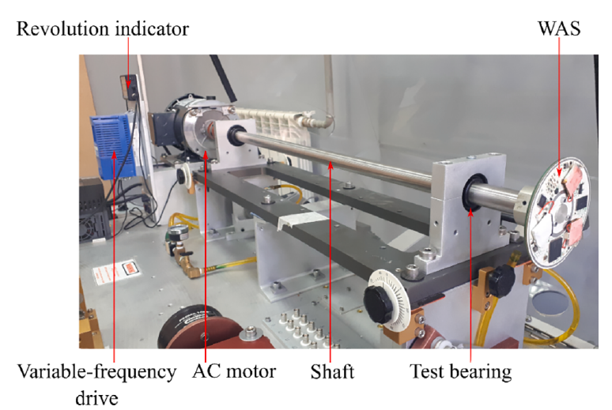
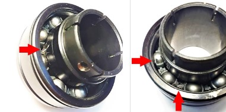
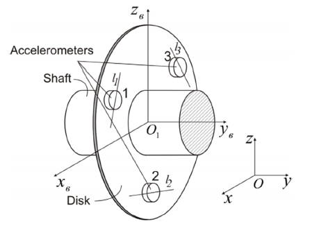
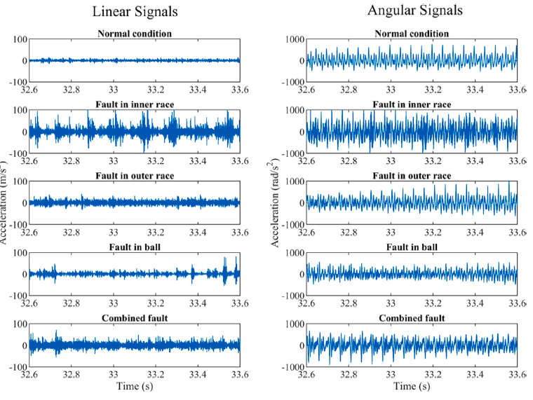
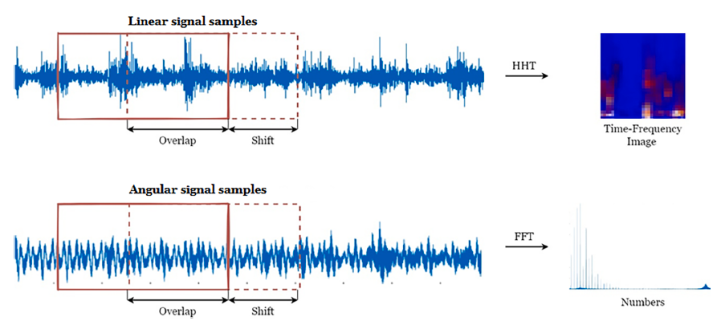

# The New Rolling Bear Fault Data Set - State University of South Urals Bear Dataset

This dataset includes data from bearing test benches. A notable feature of the dataset is its collection method: wireless sensors measuring line and angular acceleration are directly mounted on the rotating shaft.

**References are included.**
1. All code has been tested and works without issues.
2. Please carefully read the project description before taking a shot, as it's very important as it involves different programming languages (Python or MATLAB).
3. As a special product, if you buy it, you can't return it after purchase; please contact us in case of any issues promptly.
5. No explanation of this code will be provided.

## Images

Here is a pay link on Stripe ( https://buy.stripe.com/3cs8yP7sY87d0vu9AB ). Please contact me lonlonago@foxmail.com after funding $89, and I will send you a complete data files , thank you!

